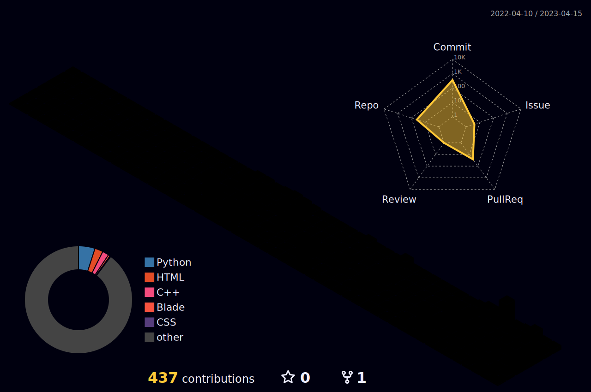

<body>
  

    <h1> Hi there, I'm Samsor Rahman👋<a href="#"></h1>
  

	
 ## Let's Grow Together
- [DevOps Blogs](https://medium.com/@samsorrahman)
- [DevOps Free Resources](https://github.com/samsorrahman/Learn-DevOps-from-zero-to-hero)

	

### I'm a DevOps Engineer, Teacher, and Researcher!
- I’m currently working as a freelancer.
- I’m currently enhancing my DevOps skills 
- I’m looking for help with finding projects to contribute to!
- Ask me about open source, Backend Development | Infrastructure | DevOps | React | Community Building.
- 2024 Goals: Helping Individuals to master DevOps Tools 
- let's get connected
- Fun Fact: I love eating 

### Currently Mastering Kubernetes & Terraform/Ansible Automation

ASK ME IN

- 🐚 Linux Shell Scripting
- 🐍 Python
- 🐳 Docker
- 🛠️ Jenkins
- ☸️ Kubernetes
- 🌐 Terraform
- 📊 Grafana
- ⚙️ Ansible

Feel free to connect with me if you'd like to discuss DevOps practices or collaborate on related projects.

### Contact Me

- 📧 Email: samsorrahman20@gmail.com
- 🌐 LinkedIn: [LinkedIn Profile](https://www.linkedin.com/in/samsor-rahman18/)
- 📝 Medium: [Medium Profile](https://medium.com/@samsorrahman)

 

 
<h2>Tech Stack</h2>

<table width="100">
<tr>
    <td align='center' width="190">
        
    </td>
    <td align='center' width="190">
        
    </td>
    <td align='center' width="190">
        
    </td>
     <td align='center' width="190">
        
    </td>
    <td align='center' width="190">
        
    </td>
</tr>

<tr>
    <td align='center'>
        
    </td>
    <td align='center'>
        
    </td>
    <td align='center'>
        
    </td>
    <td align='center' width="190">
        
    </td>
 <td align='center'>
        
    </td> 
</tr>
<tr>
    <td align='center'>
        
    </td>
    <td align='center'>
        
    </td>
    <td align='center'>
        
    </td>
 <td align='center'>
    
</td>

</tr>
<tr>
    <td align='center'>
        
    </td>
    <td align='center'>
        
    </td>
    <td align='center'>
        
    </td>
    <td align='center'>
        
    </td>
    <td align='center'>
        
    </td>
</tr>

<tr>
    <td align='center'>
        
    </td>
    <td align='center'>
        
    </td>
    <td align='center'>
        
    </td>
    <td align='center'>
        
    </td>
    <td align='center'>
        
    </td>
</tr>
    
</table>

 

  

 
 

## Personal Projects

|      Project :octocat:   |     Issues :bug:   | Open PRs :bell:  | Closed PRs :fire:  | Last Commit 🚩
|-------------|-------------------|---|---| ----|
| [**My First Repository**](https://github.com/samsorrahman/samsorrahman) |  |   |   | |
| [**Github Profile**](https://github.com/samsorrahman/samsorrahman) |  |   |    | |
| [**Data Structure in c++**](https://github.com/samsorrahman/Data-Structure-in-c-) |  |   |   | |

	
 
 <h2>GitHub Analytics
 </h2>

  

 
	

	
	
## ⚡️GitHub Contributions
	
<h4 align="center">Isometric view of contributions in the last year</h4>

	

## 🚀GitHub Metrics

	

	

  7.  🗣️ **LANGUAGES** 
| Language | Level         |
|----------|---------------|
| Pashto   | Professional  |
| Dari     | Professional  |
| English  | Professional  |
| Urdu     | Intermediate |

## 🐛GitHub Magic Game

  

 
<h2 >🏆 GitHub Profile Trophy</h2>

 
  Views 
  

## 🐛My Latest Blogs

  
 
	
### ✍️ Quote (Refresh for more)

 
	
# I love open-source

 

